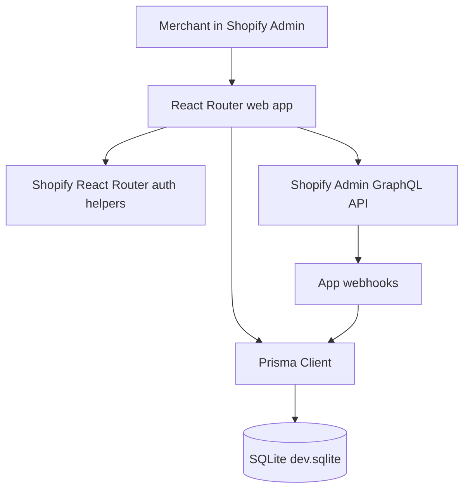
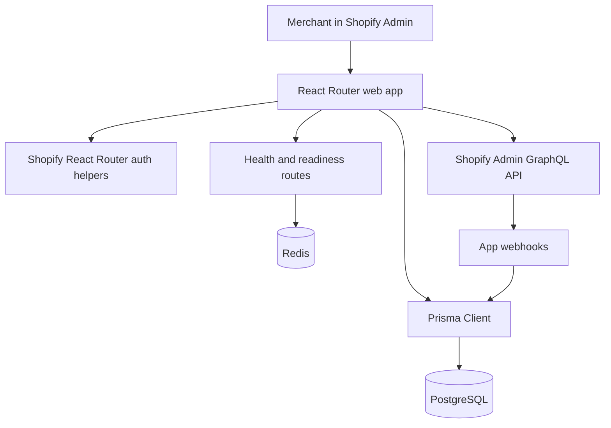
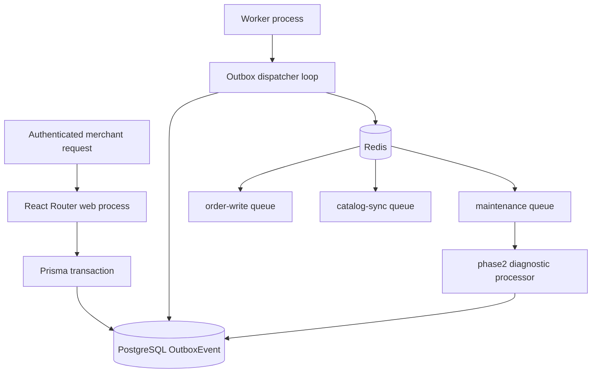
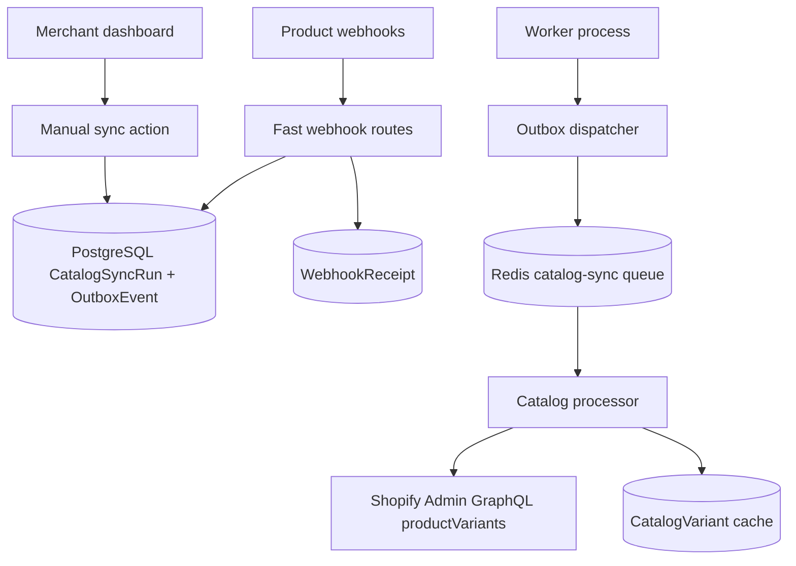
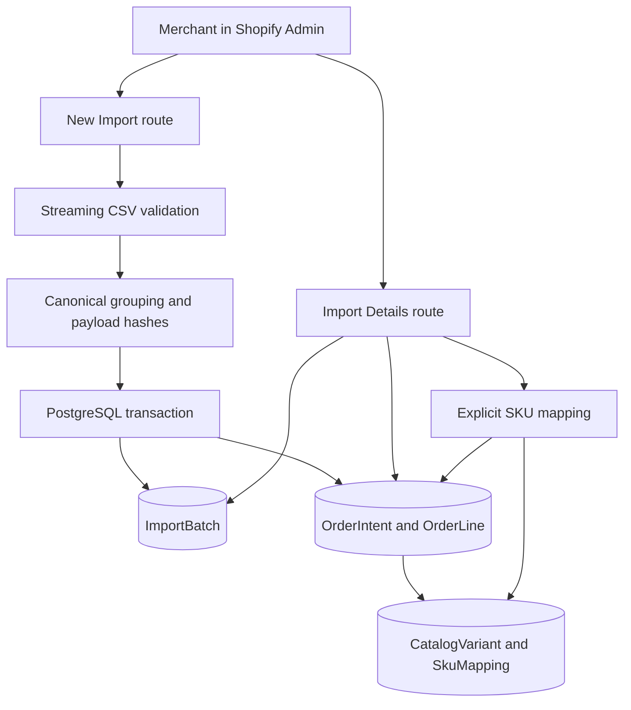
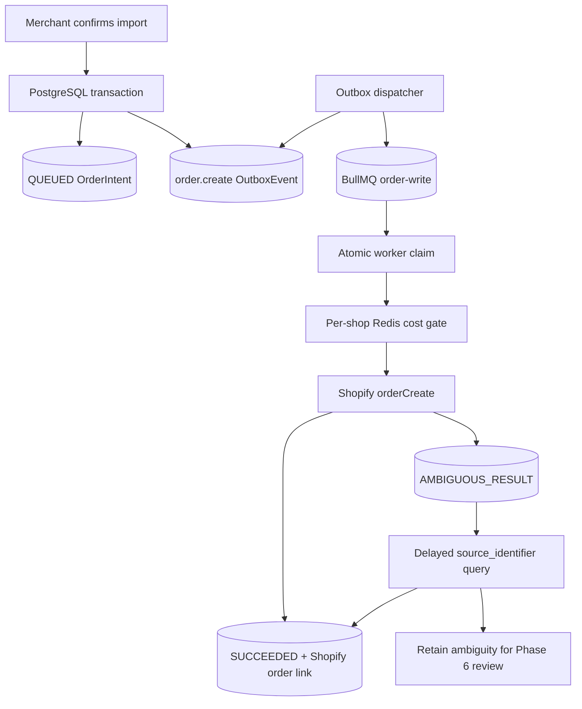
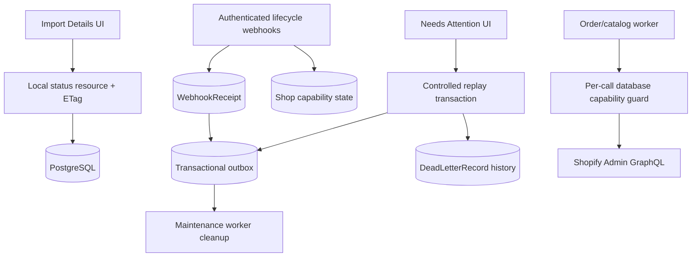
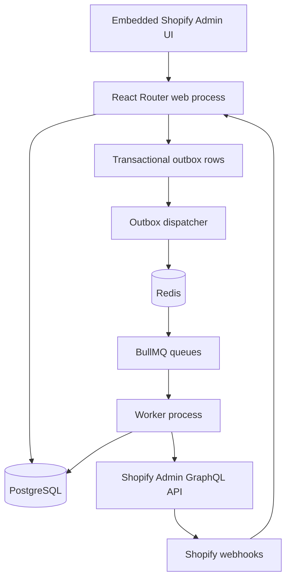

# OrderRelay Architecture

OrderRelay is planned as a focused Shopify embedded application for reliable CSV-based external order ingestion. The MVP imports orders from external systems into Shopify while preventing duplicate business writes and keeping progress visible from local state.

## Phase 0 Baseline Architecture

Phase 0 baseline behavior:

- Authenticated embedded pages use `authenticate.admin`.
- The app layout renders only Home and Additional page navigation.
- The home action makes synchronous demo Admin GraphQL mutations.
- Webhooks use `authenticate.webhook` and return directly after session changes.
- Prisma stores only Shopify sessions.
- There is no queue, worker, outbox, catalog cache, import domain, local pagination, or dead-letter workflow.

## Phase 1 Foundation Architecture

Phase 1 behavior:

- Prisma now targets PostgreSQL through `DATABASE_URL`.
- PostgreSQL schema foundation exists for sessions, shops, catalog cache, imports, order intents, outbox events, webhook receipts, and dead-letter records.
- Redis is configured for local infrastructure and readiness checks, but no BullMQ queues or workers are implemented yet.
- Shopify auth still uses the existing Shopify React Router helpers and Prisma session adapter.
- `/health` and `/ready` provide liveness and dependency readiness without exposing secrets.

## Phase 2 Queue And Worker Architecture

Phase 2 behavior:

- The web process can create durable `OutboxEvent` rows inside PostgreSQL transactions.
- The separate worker process owns the outbox dispatcher and BullMQ workers.
- The dispatcher publishes unpublished outbox rows to deterministic BullMQ job IDs and marks rows published only after queue publication succeeds.
- Redis outages leave unpublished database events behind for later retry.
- Duplicate publication is harmless because the same outbox event maps to the same BullMQ job ID and the database update is conditional on `publishedAt` still being null.
- The maintenance queue contains a harmless `phase2.diagnostic` processor that reloads the outbox event from PostgreSQL and logs safe operational metadata.
- The `order-write` and `catalog-sync` queues exist, but their real processors are intentionally deferred to later phases.

## Phase 3 Catalog Cache Architecture

Phase 3 behavior:

- The dashboard reads cache status, stale age, ambiguous SKU counts, and recent variants from PostgreSQL.
- Manual sync creates or reuses a running `CatalogSyncRun` and queues `catalog.bootstrap` through the transactional outbox.
- The catalog worker uses Shopify Admin GraphQL `productVariants(first, after)` pagination and saves a checkpoint after each processed page.
- A restarted or retried sync resumes from `CatalogSyncRun.lastProcessedCursor`.
- A completed full sync marks variants not seen in the successful run as deleted. Failed syncs preserve the previous active cache and mark the shop stale or failed.
- Product create/update/delete webhook routes authenticate and deduplicate deliveries, persist a `WebhookReceipt`, enqueue a targeted product refresh, and return without calling Shopify.
- Duplicate SKUs are stored as separate `CatalogVariant` rows and reported as ambiguous by SKU resolution.
- Local catalog lists use opaque keyset cursors instead of large offset queries.
- The worker includes a reconciliation scheduler that periodically inserts sync outbox work for active shops with stale, failed, missing, or never-synced cache state.

## Phase 4 Import Domain Architecture

Phase 4 behavior:

- The web process streams uploaded CSV content through a maintained parser, enforces byte and row limits, and rejects malformed or inconsistent rows with bounded merchant-safe errors.
- Rows are grouped by external order identity. Normalized order data and deterministically sorted lines form a canonical SHA-256 payload hash.
- Raw CSV files are not persisted or logged. PostgreSQL stores only the normalized order fields needed by later phases.
- A draft batch and any new intents/lines are committed atomically. Missing or duplicate catalog SKUs change only their affected intents to mapping states.
- `(shopId, idempotencyKey)` protects batch requests. `(shopId, sourceSystem, externalOrderId)` protects the durable business order identity.
- `ImportBatchOrderIntent` allows a later batch to reference an existing same-hash intent. A different hash returns a conflict and leaves the existing identity unchanged.
- Preview and mapping access derive the tenant from the authenticated Shopify session; browser-provided shop identifiers never authorize data access.
- Import details use opaque descending `createdAt, id` keyset cursors. Mapping selections are verified against active catalog variants in the same shop.
- This phase produces drafts only. No order outbox events, BullMQ order jobs, or Shopify order mutations are created.

## Phase 5 Order Creation Architecture

Phase 5 behavior:

- Confirmation performs no Shopify calls. It atomically queues eligible order intents, assigns deterministic hashed source identifiers, updates the import batch, and creates minimal outbox events.
- The order worker reloads tenant state and offline Admin access, checks shop capabilities, no-ops completed intents, and claims only `QUEUED` or due `RETRY_WAIT` records with conditional database updates.
- Order creation uses `orderCreate` with resolved variant GIDs and imported decimal unit prices. It sends no payment transaction and persists only the resulting order GID/name plus sanitized error state.
- A Redis Lua gate coordinates GraphQL capacity by shop across order and catalog worker processes. Actual Shopify cost/throttle metadata refreshes the budget; catalog work preserves background headroom for higher-priority order work.
- Throttled and safely retryable work is delayed in BullMQ without busy-waiting. Duplicate deliveries either fail the atomic claim, wait for the active lease, or no-op after success.
- A missing or inconclusive mutation response and an expired create lease are treated conservatively as potentially successful writes. They transition to `AMBIGUOUS_RESULT` and create delayed reconciliation work instead of blindly issuing `orderCreate` again.
- Reconciliation is a read-only `orders` search by exact `source_identifier`. One match records success; zero results retry up to a configured bound; zero or multiple final matches remain ambiguous for merchant review in Phase 6.
- This phase implements effectively-once order creation safeguards under at-least-once delivery. It does not claim guaranteed exactly-once execution.

## Phase 6 Status And Recovery Architecture

Phase 6 behavior:

- Import progress is served entirely from tenant-scoped PostgreSQL data. Conditional requests use the batch version and update time, while the browser backs off on unchanged responses, pauses when hidden, and stops at terminal states.
- Permanent order failures atomically transition to `DEAD_LETTER`, create sanitized `DeadLetterRecord` history, and refresh linked batch aggregates.
- Needs Attention is a local keyset-paginated view of mapping failures, ambiguous write results, and dead-lettered intents.
- A dead-letter replay retains the original `OrderIntent` and deterministic Shopify source identifier. It checks current shop capabilities and active variant mappings, records the replay on the prior failure, and creates a new outbox event.
- Ambiguous writes can only be rechecked through read-only reconciliation. Merchant actions cannot bypass ambiguity safeguards to issue a blind create.
- Lifecycle webhook delivery IDs are deduplicated before any state change. Uninstall and scope state is committed in the HTTP transaction; broader cancellation, pausing, and resumption runs through maintenance work.
- Every order and catalog GraphQL call rechecks durable shop status and the operation-specific scope immediately before network dispatch. Redis queue state is not trusted as the capability source of truth.

## Target Architecture

Target rules:

- PostgreSQL is the source of truth for merchant state, catalog cache, imports, order intents, outbox events, webhook receipts, and dead-letter records.
- Redis and BullMQ coordinate delivery and retries; they are not permanent business storage.
- HTTP routes must not create many Shopify orders synchronously.
- Progress polling reads PostgreSQL only.
- Worker processing is restart-safe and treats queue delivery as at-least-once.
- Shopify access tokens, raw CSV rows, customer addresses, phones, and emails are never placed in queue payloads or logs.
- Business idempotency is enforced with database constraints, deterministic identifiers, state transitions, and reconciliation.

## Domain Model

Planned tenant-owned models:

- `Shop`: installed merchant state, granted scopes, uninstall markers, catalog freshness, and status.
- `CatalogVariant`: local read model of Shopify product variants, indexed by shop and normalized SKU but not unique by SKU.
- `SkuMapping`: source-system SKU mappings to selected Shopify variant GIDs.
- `ImportBatch`: one uploaded CSV import attempt and aggregate progress counts.
- `OrderIntent`: durable business identity for one external order.
- `OrderLine`: line-level parsed SKU, mapping, quantity, unit price, and validation state.
- `OutboxEvent`: durable event awaiting publication to BullMQ.
- `WebhookReceipt`: dedupe record for Shopify webhook deliveries.
- `DeadLetterRecord`: safe reference to permanently failed work.
- `CatalogSyncRun` or checkpoint model: resumable Shopify catalog pagination state.

Every tenant-owned query must be scoped by the authenticated or internally trusted shop. Browser-supplied shop IDs or domains must not authorize data access.

## Runtime Processes

Web process:

- Handles Shopify OAuth and embedded app authentication.
- Serves loaders/actions/resource routes.
- Parses CSV uploads, validates input, writes import records, and inserts outbox events.
- Authenticates webhooks, persists receipts/outbox events, and returns quickly.
- Exposes local status and pagination APIs backed by PostgreSQL.

Worker process:

- Dispatches outbox events to BullMQ or runs a dispatcher loop alongside processors.
- Processes order write, catalog sync, reconciliation, webhook, and maintenance jobs.
- Reloads business state from PostgreSQL before doing work.
- Gets an offline Admin GraphQL client with `unauthenticated.admin(shop)` using a shop domain loaded from trusted database state.
- Performs atomic claims and controlled state transitions.
- Records sanitized errors and dead-letter state when retry limits are exhausted.

## Key Workflows

CSV import:

1. Merchant opens New Import.
2. Merchant enters a source system and uploads a CSV.
3. Browser-generated idempotency key is submitted with the upload.
4. Server validates size, content, headers, and row count.
5. Rows are streamed, grouped by `external_order_id`, normalized, and hashed.
6. Import batch, order intents, and order lines are stored transactionally.
7. SKU resolution uses local catalog cache and source-system mappings.
8. Ready orders can be confirmed, which inserts outbox events instead of calling Shopify inline.
9. Workers create Shopify orders and update local progress.

Catalog sync:

1. A sync job pages Shopify product variants with `first` and `after`.
2. Each processed page updates variants and stores a checkpoint.
3. A completed full sync marks variants not seen in that run as deleted.
4. Failed syncs preserve the previous valid cache and mark staleness.

Webhook ingestion:

1. HTTP route authenticates with `authenticate.webhook`.
2. Route stores a unique receipt by shop/topic/webhook ID and a minimal outbox event.
3. Duplicate deliveries become no-ops.
4. Workers process catalog refresh, uninstall, or scope-change effects outside the request.

Order creation:

1. Confirming a batch queues order intents through the outbox.
2. Worker atomically claims `QUEUED` or due `RETRY_WAIT` records.
3. Worker creates Shopify orders using deterministic source identifiers.
4. Safe user errors move to Needs Attention; transient errors retry with backoff.
5. Ambiguous write results enter reconciliation before any blind retry.
6. Succeeded and already-terminal intents no-op on duplicate jobs.

## Observability And Safety

Structured logs should include safe operational keys such as shop domain, import batch ID, order intent ID, job ID, and operation name. Logs must exclude emails, addresses, phone numbers, raw CSV contents, access tokens, and stack traces sent to merchants.

Health checks should distinguish:

- Web process liveness.
- PostgreSQL readiness.
- Redis readiness.
- Worker queue connectivity.
- Catalog cache freshness.

The app should report reliability honestly: it aims for effectively-once business behavior under at-least-once delivery, not guaranteed exactly-once processing.
